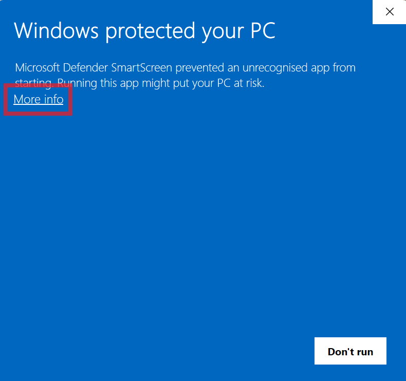
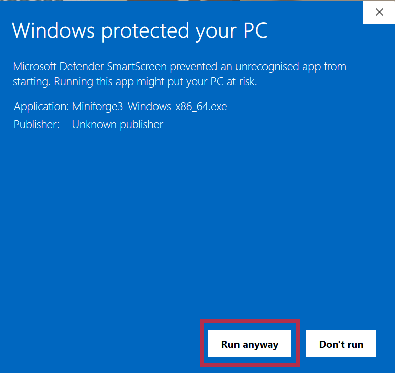
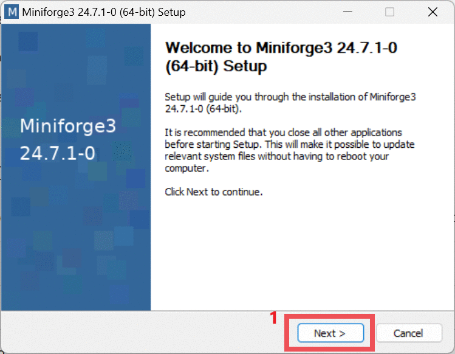
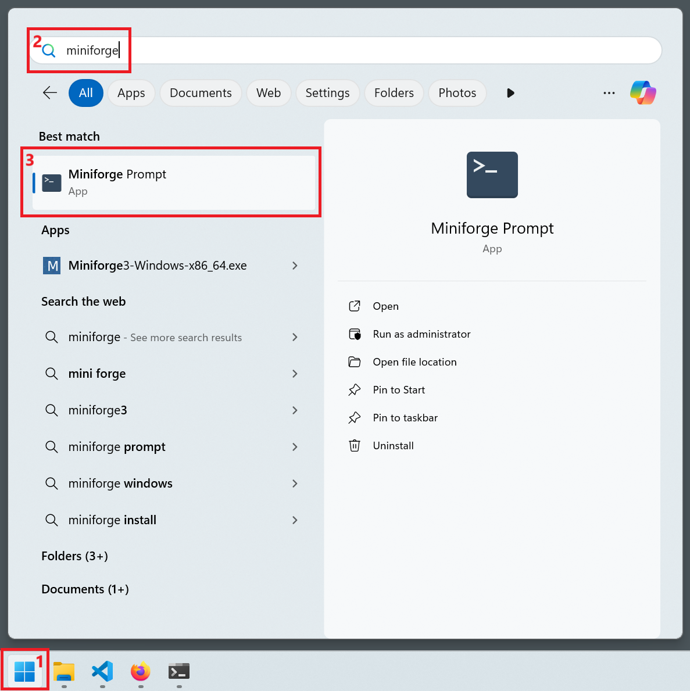

::: {.panel-tabset group="os"}
#### Windows 10/11

- Download the Miniforge3 installer [from this link](https://github.com/conda-forge/miniforge/releases/latest/download/Miniforge3-Windows-x86_64.exe)
- Double-click the downloaded file to start the installation wizard
- You may get a warning from Windows Defender



- Click "**More info**" and then "**Run anyway**"



- Proceed with the installation accepting all the defaults



- To use `mamba` you can search your windows menu for "miniforge" and click on the "**Miniforge Prompt**" application



- This should open a terminal, which starts with the word `(base)`.
- Copy and paste the following commands to finish setting up your installation: 

    ```bash
    conda config --add channels defaults
    conda config --add channels bioconda
    conda config --add channels conda-forge
    conda config --set channel_priority strict
    conda config --set remote_read_timeout_secs 1000
    ```


#### macOS

Open a terminal and copy/paste the following commands (this will install Mamba in its default location in the home directory): 

```bash
curl -L -O "https://github.com/conda-forge/miniforge/releases/latest/download/Miniforge3-$(uname)-$(uname -m).sh"
/bin/bash Miniforge3-$(uname)-$(uname -m).sh -b -p $HOME/miniforge3
rm Miniforge3-$(uname)-$(uname -m).sh
$HOME/miniforge3/bin/mamba init --all
```

Restart your terminal and confirm that your shell now starts with the word `(base)`.
Copy and paste the following commands to finish setting up your installation: 

```bash
conda config --add channels defaults
conda config --add channels bioconda
conda config --add channels conda-forge
conda config --set channel_priority strict
conda config --set remote_read_timeout_secs 1000
```

#### Linux

Open a terminal and copy/paste the following commands (this will install Mamba in its default location in the home directory): 

```bash
wget "https://github.com/conda-forge/miniforge/releases/latest/download/Miniforge3-$(uname)-$(uname -m).sh"
bash Miniforge3-$(uname)-$(uname -m).sh -b -p $HOME/miniforge3
rm Miniforge3-$(uname)-$(uname -m).sh
$HOME/miniforge3/bin/mamba init
```

Restart your terminal and confirm that your shell now starts with the word `(base)`.
Copy and paste the following commands to finish setting up your installation: 

```bash
conda config --add channels defaults
conda config --add channels bioconda
conda config --add channels conda-forge
conda config --set channel_priority strict
conda config --set remote_read_timeout_secs 1000
```

:::