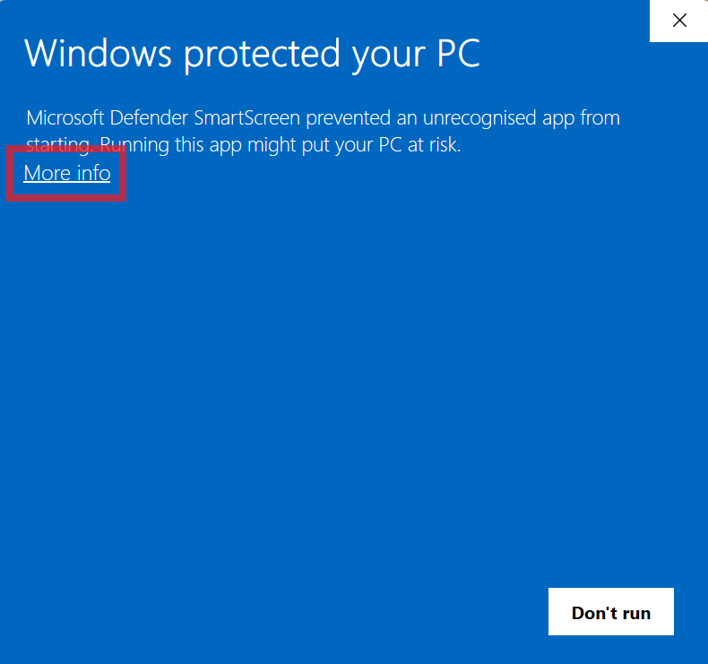
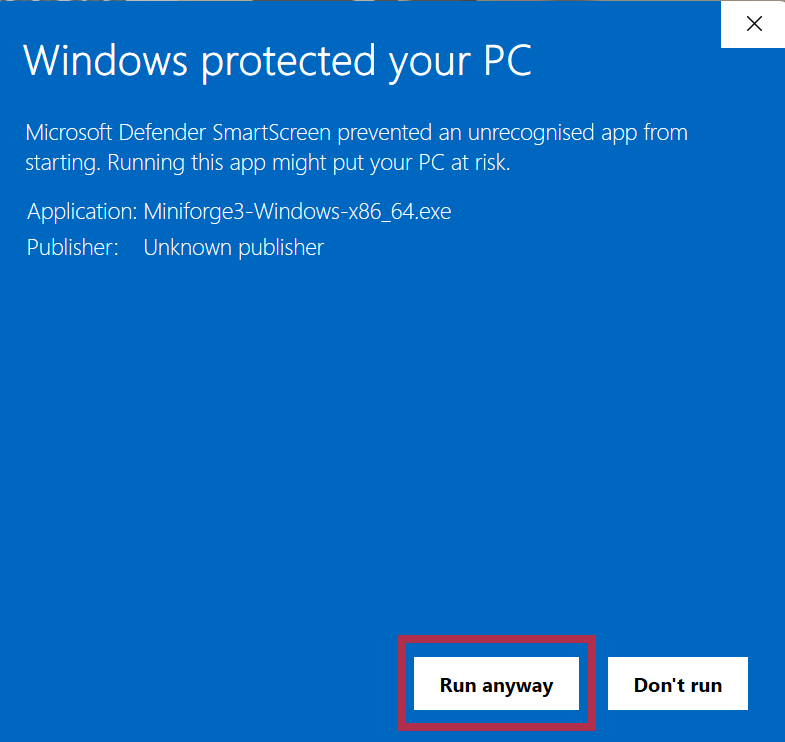
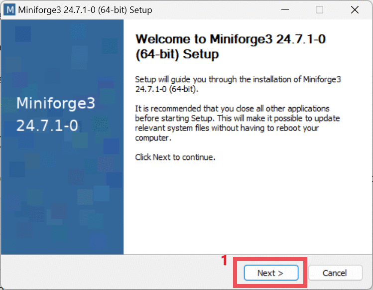
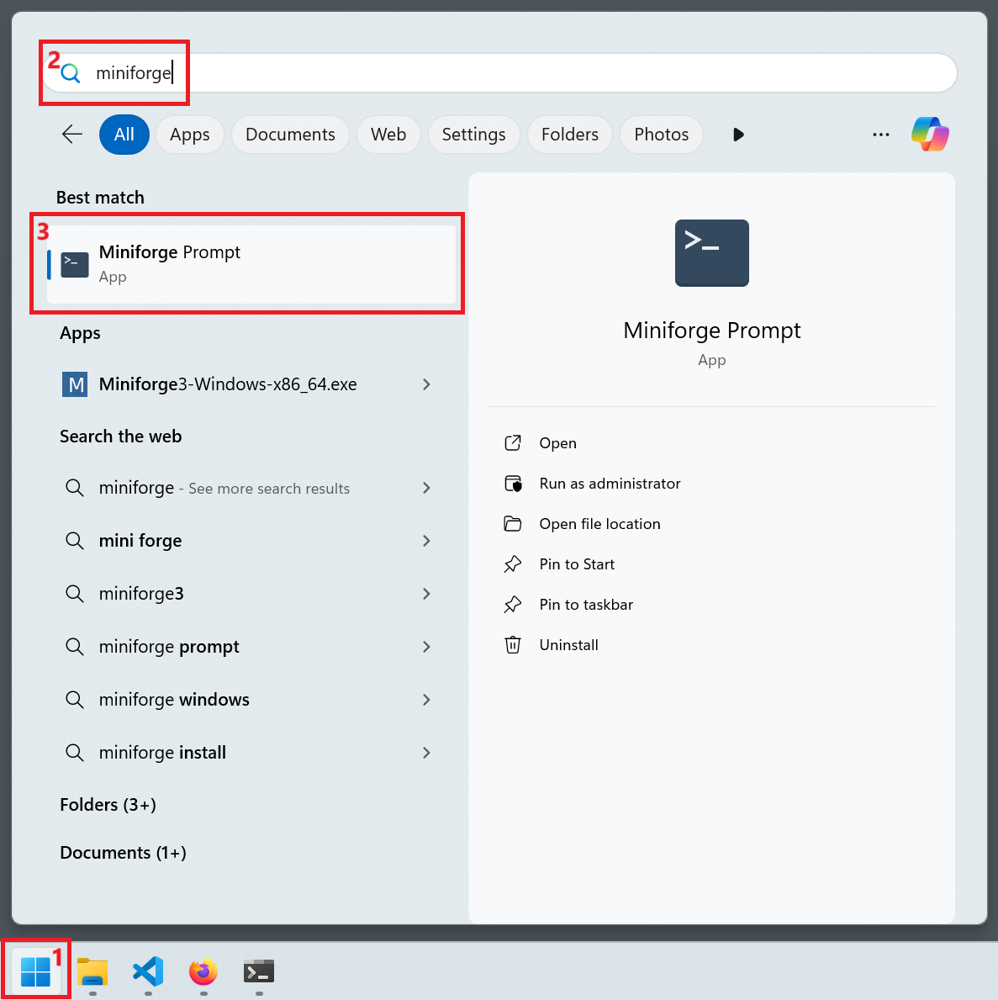

# Conda/Mamba

**Mamba** is a popular package manager in data science, scientific computing and bioinformatics, which is a successor to another package manager called Conda.
Below we give instructions on how to use the Miniforge installer on all major operating systems.

::: {.panel-tabset group="os"}
#### Windows 10/11

:::{.callout-important}
#### WSL2 users

The instructions below are for a native Mamba Windows installer. 
However, we **highly recommend that you consider using WSL2 instead** ([WSL setup instructions](wsl.md)).
If that is the case, then follow the instructions on the "Linux" tab.
:::

:::{.callout-note collapse=true}
#### Windows Miniforge installation instructions

Are you sure you want to install Mamba natively on Windows?

Many packages do not work properly on Windows, especially in fields like data science, statistics and bioinformatics.
For that reason, we really recommend that you consider [setting up WSL2](wsl.md) first, and then follow the Linux instructions on this page.

:::{.callout-note collapse=true}
#### Yes, I'm sure, show me the Windows instructions

- Download the Miniforge3 installer [from this link](https://github.com/conda-forge/miniforge/releases/latest/download/Miniforge3-Windows-x86_64.exe)
- Double-click the downloaded file to start the installation wizard
- You may get a warning from Windows Defender



- Click "**More info**" and then "**Run anyway**"



- Proceed with the installation accepting all the defaults



- To use `mamba` you can search your windows menu for "miniforge" and click on the "**Miniforge Prompt**" application



- This should open a terminal, which starts with the word `(base)`.
- Copy and paste the following commands to finish setting up your installation:

    ```bash
    conda config --add channels bioconda
    conda config --add channels conda-forge
    conda config --set channel_priority strict
    conda config --set remote_read_timeout_secs 1000
    ```

:::
:::

#### macOS

- Open a terminal and copy/paste the following commands (this will install Mamba in its default location in the home directory):

    ```bash
    curl -L -O "https://github.com/conda-forge/miniforge/releases/latest/download/Miniforge3-$(uname)-$(uname -m).sh"
    /bin/bash Miniforge3-$(uname)-$(uname -m).sh -b -p $HOME/miniforge3
    rm Miniforge3-$(uname)-$(uname -m).sh
    $HOME/miniforge3/bin/mamba shell init
    ```

- **Restart your terminal** and run the command `mamba activate base`.
  - Your prompt should now start with the word `(base)`, indicating the installation was succesful.

- Copy and paste the following commands to finish setting up your installation:

    ```bash
    conda config --add channels bioconda
    conda config --add channels conda-forge
    conda config --set channel_priority strict
    conda config --set remote_read_timeout_secs 1000
    ```

#### Linux

- Open a terminal and copy/paste the following commands (this will install Mamba in its default location in the home directory):

    ```bash
    wget "https://github.com/conda-forge/miniforge/releases/latest/download/Miniforge3-$(uname)-$(uname -m).sh"
    bash Miniforge3-$(uname)-$(uname -m).sh -b -p $HOME/miniforge3
    rm Miniforge3-$(uname)-$(uname -m).sh
    $HOME/miniforge3/bin/mamba shell init
    ```

- **Restart your terminal** and run the command `mamba activate base`.
  - Your prompt should now start with the word `(base)`, indicating the installation was succesful.

- Copy and paste the following commands to finish setting up your installation:

    ```bash
    conda config --add channels bioconda
    conda config --add channels conda-forge
    conda config --set channel_priority strict
    conda config --set remote_read_timeout_secs 1000
    ```

:::

Finally, **check your setup** by running the following commands:

```bash
mamba --version
```

```output
2.1.1
```

```bash
conda --version
````

```output
25.3.1
```

```bash
conda config --show channels
```

```output
channels:
  - conda-forge
  - bioconda
```

The version numbers may be different, but the important thing is that the commands run without errors.
If you see any errors, please review the instructions above and try again.
