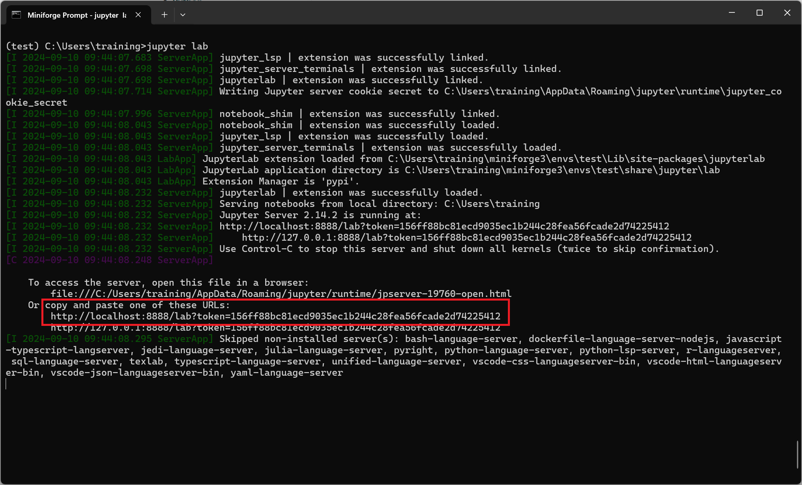

# Python

We recommend using the package manager Mamba to manage your Python installation and environments. 
Our recommendation is to create separate environments for each project or type of analysis, to avoid package version conflicts. 
In this page we give an example of creating an environment for our Python introduction course, which includes Jupyter Lab and some essential packages for data analysis. 

:::{.callout-important}
#### First install Mamba

Follow the instructions on the [mamba installation page](mamba.md). 
Then return to this page.
:::

* Open a terminal (macOS and Linux) or the Miniforge prompt (Windows)
  * Ensure that the shell starts with the word `(base)`, indicating Mamba is correctly installed.
* Create a new environment, which we will call `pycourse` (you may give your environment a name of your choice):

    ```bash
    mamba create -n pycourse
    ```

* Install JupyterLab (for notebook interface), Pandas (for data manipulation) and Seaborn (for data visualisation):

    ```bash
    mamba install -y -n pycourse jupyterlab
    ```

* The installation should complete with the following message: 

    ```
    Downloading and Extracting Packages

    Preparing transaction: done
    Verifying transaction: done
    Executing transaction: done
    ```

* Once installed, you can start JupyterLab by activating your environment and running the command to launch it:

    ```bash
    mamba activate pycourse
    jupyter lab
    ```

* JupyterLab should open in your browser automatically. If it doesn't, you can click the link that appears on the message printed on the screen:

